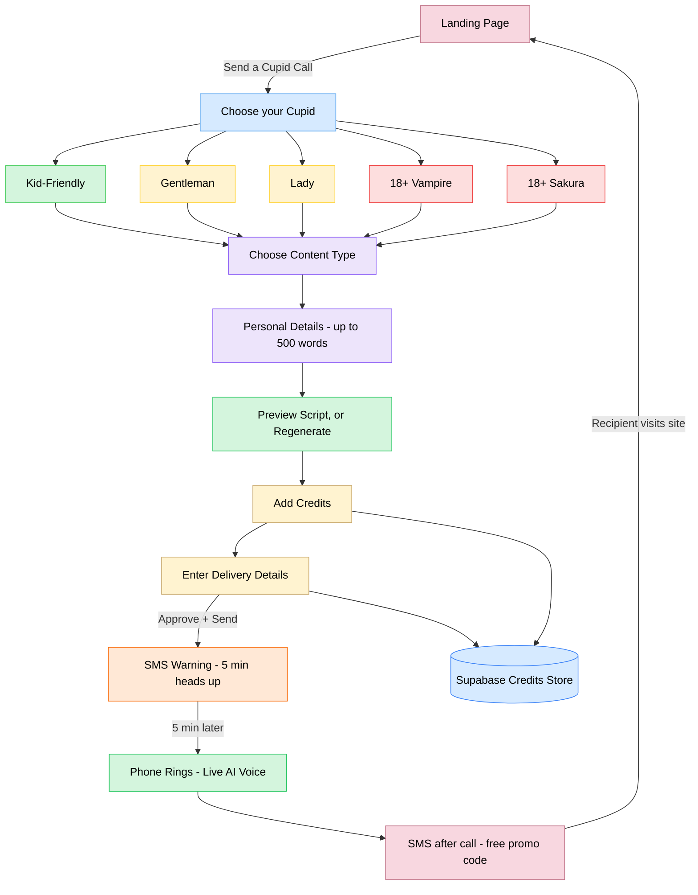
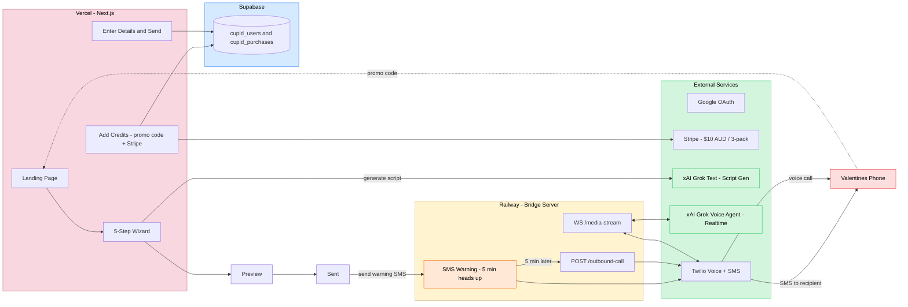

  

# Participant

| Field | Your Answer |
|---|---|
| Name | Kasey Robinson |
| University / Employer | fUnemployed |

# Project

| Field | Your Answer |
|---|---|
| Project Name | Cupid Call |
| One-Line Description | AI-generated Valentine phone calls delivered live with a character voice. |
| Demo Video Link | https://youtu.be/ccE7ewLQnI4 · https://youtu.be/RvdbwWJcyHk |
| Tech Stack | Next.js 14, React, TypeScript, Tailwind CSS, NextAuth, Stripe, Twilio, Supabase, Fastify WebSocket bridge |
| AI Provider(s) Used | xAI Grok (text + voice/realtime) |

## Demo Videos

<table>
  <tr>
    <td align="center">
      
       
      <a href="https://youtu.be/ccE7ewLQnI4">Watch Demo 1</a>
    </td>
    <td align="center">
      
       
      <a href="https://youtu.be/RvdbwWJcyHk">Watch Demo 2</a>
    </td>
  </tr>
</table>

# About Your Project

## What does it do?

Cupid Call lets a user create a personalized Valentine telegram and deliver it as a live AI phone call.  
The user chooses a content type, adds private relationship details, selects a persona, previews the generated script, and sends the call.
Credits, promo usage, and purchase records are stored in Supabase for durable tracking.

## How does the interaction work?

The sender chooses one of five characters, their intent and optional personalization.
The app generates a script with Grok, shows a preview they can re-generate (with cooldown), delivery details are entered and when sent, it triggers a Twilio outbound texts and call. 
The viral loop adds SMS touchpoints: one text 5 minutes before the call to increase pickup/recording behavior, and one text 5 minutes after the call with code LOVE to drive referral sends.
A realtime bridge streams audio between Twilio and Grok Voice so the recipient can hear the telegram and speak back briefly.  

## What makes it special?

It combines high-personalization text generation with live voice interaction in a single flow.  
Character options and scripted call framing make the experience feel playful, memorable, and safe by design.
I also incorporated 'vibe marketing' with the goal for people to share by word of mouth.

## How to run it

How to Use Cupid Call:

1. Go to https://cupidcall.bitpixi.com
2. Sign in with Google or email
3. Use code LOVE to get your first call free
4. Fill in your valentine's details, pick a character, preview the script
5. Hit send, and their phone rings with a live AI love telegram
6. Want more? Grab a 3-pack for $10 AUD

## Viral Loop

Five minutes before the call, your valentine gets a text:  
"💘 A Cupid Call is on its way, and it will come from a +1 phone number."

Five minutes after the call ends, they get another:  
"💘 Enjoyed Cupid Call? Send one 1 free with code LOVE at https://cupidcall.bitpixi.com. Reply STOP to opt out."

That's the loop for one call to become more. 92% of people trust recommendations from someone they know over any ad, and word of mouth drives 5x more sales than paid media.

## Architecture / Technical Notes

Frontend/API runs on Next.js. Checkout and webhook handling use Stripe. Supabase stores durable credits, promo redemption, and purchase records.  
Phone calls and viral-loop SMS use Twilio. Realtime two-way voice uses a separate WebSocket bridge service (`server/bridge.ts`) that connects Twilio Media Streams to xAI Realtime Voice.  
Viral loop behavior is two scheduled SMS events per successful send: pre-call alert (+5 min before call) and post-call referral message (+5 min after call end, includes promo code and opt-out language).

